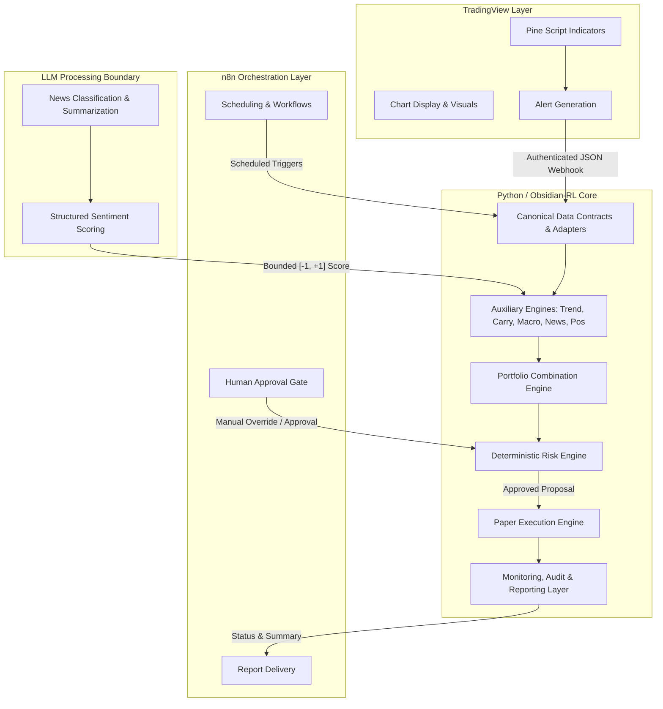

# Cross-Asset Multi-Engine Architecture

## Architectural Overview & Separation of Concerns
Obsidian-RL Research Cycle 02 establishes an institutional-grade cross-asset quantitative trading architecture. To ensure absolute reliability, mathematical correctness, and strict risk governance, the platform enforces clear, non-overlapping ownership boundaries across three core technologies: **Python (Obsidian-RL)**, **TradingView**, and **n8n**.



---

## Technology Ownership Rules

### 1. Python & Obsidian-RL (Core Quantitative Engine)
Python owns 100% of the mathematical, financial, and state-critical responsibilities of the system. Specifically, Python strictly owns:
- **Market Calculations & Indicators**: All quantitative calculations, statistical transformations, feature engineering, and technical indicators used for formal decision making.
- **Signal Generation**: All strategy proposal logic, composite weighting, and machine learning inference (`MlMetaFilterEngine`).
- **Portfolio Decisions & Position Sizing**: Capital allocation across currencies/assets, correlation weighting, and target position calculation based on volatility targets.
- **Risk Controls**: All deterministic limits, hard drawdown stops, leverage caps, venue concentration checks, and pre-trade/post-trade risk interlocks.
- **Accounting & Order State**: Complete ownership of portfolio cash/margin balances, realized/unrealized P&L, execution fee accounting, order state machine (`PROPOSED` -> `SUBMITTED` -> `FILLED`), and position lifecycle.
- **Audit History**: Immutable, append-only logging of every market tick, signal proposal, risk evaluation, and order event.

### 2. TradingView (Visual & Alerting Layer)
TradingView is strictly a visualization and visual alert generator. TradingView owns only:
- **Chart Display**: Rendering candlestick charts, overlay indicators, and historical price action for human observation.
- **Pine Script Visual Signals**: Calculating visual indicators (`ObsidianMultiAssetTrend.pine`) for human inspection on charts.
- **Alert Generation & Webhook Messaging**: Dispatching JSON webhook alerts when visual thresholds are crossed on charts.
- **Strict Prohibition**: TradingView alerts are treated by Python as *informational proposals only*. TradingView does **not** own order sizing, risk validation, portfolio accounting, or direct broker execution.

### 3. n8n (Orchestration & Workflow Layer)
n8n is strictly an external asynchronous workflow coordinator. n8n owns only:
- **Scheduling**: Cron-based triggering of data ingestion jobs, daily maintenance tasks, and model re-evaluation cycles.
- **API Workflow Coordination**: Orchestrating multi-step external data fetching tasks (e.g., triggering news ingestion pipelines or polling macroeconomic calendars).
- **Notifications & Report Delivery**: Dispatching daily summary reports, audit snapshots, and system health alerts to communication channels (e.g., Slack, Email, Telegram).
- **Human Approval Workflows**: Managing human-in-the-loop intervention gates, allowing authorized human operators to review and confirm high-impact system state changes.
- **Strict Prohibition**: n8n performs **zero** quantitative calculations, does **not** evaluate trading strategies, and does **not** hold direct exchange trading credentials.

---

## Role and Boundaries of Large Language Models (LLMs)
Large Language Models (e.g., Gemini, Claude) may be utilized within controlled auxiliary data-processing pipelines, subject to strict boundary conditions:

### Permitted LLM Responsibilities
- **News Classification**: Categorizing incoming unstructured financial news articles into predefined taxonomy classes (e.g., monetary policy, regulatory, geopolitical).
- **Event Summarization**: Extracting concise structured summaries from lengthy macroeconomic reports or central bank transcripts.
- **Structured Information Scoring**: Producing bounded numerical sentiment or surprise scores (strictly normalized to `[-1.0, +1.0]`) accompanied by structured JSON rationale and reliability weights.

### Strictly Forbidden LLM Actions
- **No Risk Rule Bypass**: LLM outputs can **never** override, relax, or bypass deterministic numerical limits defined inside the `RiskEngine` (e.g., max drawdown, leverage limits).
- **No Direct Order Submission**: LLMs are **never** permitted to generate, submit, or modify execution orders directly. All execution must flow through deterministic strategy and risk layers.
- **No Strategy Setting Modification During Trading**: LLMs **cannot** alter live strategy weights, margin thresholds, or risk parameters during an active trading session.
- **No Secret Access**: LLMs must **never** be supplied with, read, or output system API keys, exchange credentials, or private environmental secrets.

---

## Required Engine & Layer Specifications (11 Core Engines)

### 1. Market Trend Engine (`MarketTrendEngine`)
- **Responsibility**: Computes multi-timeframe trend indicators (e.g., 16/96 SMA ratio, Donchian channel breakouts, ADX trend strength) across configured cryptocurrency and forex pairs on 1H, 4H, and 1D timeframes.
- **Inputs**: Canonical `MarketBar` sequences across active assets.
- **Outputs**: Bounded directional trend scores `[-1.0, +1.0]` and regime classifications (`TRENDING_UP`, `TRENDING_DOWN`, `CHOPPY`).

### 2. Crypto Funding and Carry Engine (`CryptoFundingCarryEngine`)
- **Responsibility**: Tracks perpetual futures funding rates, spot-futures basis, and annualized carry yields across cryptocurrency exchanges.
- **Inputs**: Periodic funding rate announcements, spot close prices, and perpetual contract close prices.
- **Outputs**: Annualized carry yield score `[-1.0, +1.0]`, indicating whether holding long/short perpetual positions yields net positive cash flow after deducting execution fees.

### 3. Macro and Economic Event Engine (`MacroEconomicEventEngine`)
- **Responsibility**: Monitors official economic calendars (e.g., interest rate decisions, CPI/PCE inflation releases, non-farm payrolls, GDP growth) across major economies (US, Eurozone, UK, Japan).
- **Inputs**: Canonical `EventNewsItem` records for macroeconomic releases.
- **Outputs**: Normalized economic surprise score `(actual_value - expected_value) / historical_std` bounded to `[-1.0, +1.0]`, mapped to affected asset classes.

### 4. News and Sentiment Engine (`NewsSentimentEngine`)
- **Responsibility**: Aggregates and filters structured sentiment scores generated by external LLM/provider classifiers from financial news feeds and central bank statements.
- **Inputs**: Canonical `EventNewsItem` records with verified `sentiment_score` and `source_reliability`.
- **Outputs**: Exponentially time-decayed aggregate sentiment score `[-1.0, +1.0]` per asset/currency.

### 5. Market Positioning Engine (`MarketPositioningEngine`)
- **Responsibility**: Analyzes market-wide positioning metrics, including exchange open interest (OI) changes, long/short account ratios, liquidations, and Commitment of Traders (COT) reports for Forex.
- **Inputs**: Periodic positioning API data mapped to canonical structures.
- **Outputs**: Overcrowding and liquidation vulnerability score `[-1.0, +1.0]` (e.g., extreme crowded longs produce a negative contrarian score).

### 6. Portfolio Combination Engine (`PortfolioCombinationEngine`)
- **Responsibility**: Combines outputs from the Market Trend, Funding/Carry, Macro, News, and Positioning engines into target asset allocations using predefined weighting matrices and cross-asset correlation adjustments.
- **Inputs**: Directional scores from engines 1 through 5 and current portfolio equity/exposure state (`PortfolioObs`).
- **Outputs**: Target capital allocation and direction per asset (`target_exposure` in `[-1.0, +1.0]`).

### 7. Risk Engine (`RiskEngine`)
- **Responsibility**: Serves as the ultimate deterministic safety gate. Intercepts every proposal from the Portfolio Combination Engine and subjects it to hard, immutable risk checks.
- **Inputs**: Target exposure proposals, current portfolio margin/cash balances, recent drawdown, venue exposure, and market data freshness.
- **Outputs**: `APPROVED_PROPOSAL` (passed identical or scaled down) or `REJECTED_PROPOSAL` (vetoed to flat/existing position).
- **Key Checks**: Max portfolio drawdown (`<= 15%`), max leverage per asset, venue concentration caps, and **Default-Deny** gating upon stale data (`observed_at_utc` > threshold).

### 8. Paper Execution Engine (`PaperExecutionEngine`)
- **Responsibility**: Simulates realistic execution of risk-approved order proposals against historical or live paper market data without financial risk.
- **Inputs**: `APPROVED_PROPOSAL` from Risk Engine, real-time bid/ask quotes, volume profiles.
- **Outputs**: Simulated order fills, trade execution accounting, realized P&L updates, and order state transitions (`PROPOSED` -> `SUBMITTED` -> `FILLED`).
- **Realism Controls**: Enforces conservative taker fee deduction (`0.05%`), half-spread crossing, and volume-dependent fill latency/slippage modeling.

### 9. TradingView Signal Layer (`TradingViewSignalLayer`)
- **Responsibility**: Receives and validates authenticated JSON webhook alerts originating from TradingView Pine Script indicators.
- **Inputs**: HTTP POST requests containing JSON alert payloads and HMAC security headers.
- **Outputs**: Validated signal proposal events inserted into the data ingestion queue (`observed_at_utc` stamped immediately upon receipt).

### 10. n8n Orchestration Layer (`N8nOrchestrationLayer`)
- **Responsibility**: Handles external scheduling triggers, workflow coordination, system status notification dispatch, and human-in-the-loop intervention requests.
- **Inputs**: Cron events, external API webhook triggers, and status updates from the Monitoring/Audit Engine.
- **Outputs**: API command dispatches, status alerts sent to Slack/Email, and human approval state updates.

### 11. Monitoring, Audit and Reporting Layer (`MonitoringAuditEngine`)
- **Responsibility**: Maintains complete operational transparency and immutable state history across all engines.
- **Inputs**: Every incoming data bar, engine score calculation, portfolio proposal, risk decision, and execution fill.
- **Outputs**: Structured JSONL audit logs (`<appDataDir>/brain/<conversation-id>/audit.jsonl`), real-time system health metrics, and formatted daily performance summaries.

---

## Canonical Data Contracts & Look-Ahead Prevention

To guarantee zero look-ahead bias and absolute consistency across live, paper, and backtest execution, all engines consume data strictly via immutable dataclasses defined in `src/obsidian_rl/data/contracts.py`.

### 1. Market Bar Schema (`MarketBar`)
```python
@dataclass(frozen=True)
class MarketBar:
    asset_class: str          # e.g., 'CRYPTO', 'FOREX', 'EQUITY', 'COMMODITY'
    venue: str                # e.g., 'BINANCE', 'BYBIT', 'OANDA'
    symbol: str               # e.g., 'BTCUSDT', 'EUR_USD'
    timeframe: str            # e.g., '15m', '1h', '4h', '1d'
    timestamp_utc: int        # Bar open timestamp (milliseconds since epoch UTC)
    observed_at_utc: int      # Exact wall-clock receipt timestamp (ms UTC)
    open: float               # Open price (finite > 0)
    high: float               # High price (finite >= open, low, close)
    low: float                # Low price (finite <= open, high, close)
    close: float              # Close price (finite > 0)
    bid: float                # Closing bid quote (finite > 0)
    ask: float                # Closing ask quote (finite >= bid)
    volume: float             # Total base volume traded (finite >= 0)
    data_source: str          # e.g., 'OANDA_API', 'BINANCE_WS', 'PARQUET_STORE'
    data_version: str         # Schema version fingerprint (e.g., 'SCHEMA_V2')
    row_hash: str             # Deterministic SHA-256 hash of canonical fields
```

### 2. Event and News Schema (`EventNewsItem`)
```python
@dataclass(frozen=True)
class EventNewsItem:
    event_id: str             # Unique event identifier / GUID
    source: str               # e.g., 'OANDA_ECO_CAL', 'REUTERS', 'FED_RELEASE'
    source_reliability: float # Historical reliability weight in [0.0, 1.0]
    original_published_at: int# Official release timestamp (ms UTC)
    first_observed_at: int    # Exact system receipt timestamp (ms UTC)
    updated_at: int           # Revision timestamp (ms UTC; equal to first_observed if unrevised)
    affected_assets: tuple[str, ...] # Tuple of symbols/asset classes affected
    event_type: str           # e.g., 'INTEREST_RATE', 'CPI', 'NEWS_ARTICLE', 'COT_REPORT'
    expected_value: float     # Market consensus expectation (finite or NaN if N/A)
    actual_value: float       # Published actual figure (finite or NaN if N/A)
    surprise_value: float     # Normalized surprise score (actual - expected) / std
    raw_content_hash: str     # SHA-256 hash of raw payload/article text
    sentiment_score: float    # Structured sentiment in [-1.0, +1.0]
    revision_status: str      # e.g., 'INITIAL', 'REVISED', 'FINAL'
```

### 3. Look-Ahead Prevention Rules
1. **Strict Point-In-Time Indexing**: All historical simulations and live decision loops index data strictly by `observed_at_utc` (for bars) and `first_observed_at` (for news/events), **never** by `original_published_at` or `timestamp_utc`.
2. **Future Timestamp Rejection**: Any contract constructed with an `observed_at_utc` greater than current system wall-clock time (`time.time() * 1000 + max_skew_ms`) triggers an immediate `RuntimeError` and halts ingestion.
3. **Immutable Checksum Verification**: Every `MarketBar` and `EventNewsItem` calculates its `row_hash`/`raw_content_hash` upon creation. Downstream engines reject any contract whose computed hash differs from its stored hash.
4. **Revision Isolation**: When macroeconomic figures are revised (`revision_status == 'REVISED'`), the revision is emitted as a **new** `EventNewsItem` with a new `first_observed_at` timestamp. Historical bars prior to the revision timestamp can never access the revised figure.

---

## Security Architecture & Gating

### 1. Secret & Credential Management
- **Environment Variables Only**: All API tokens, exchange secrets, and HMAC signing keys must be loaded via system environment variables or secure secret managers (`os.environ`).
- **Zero Credentials in Git**: No credentials, private URLs, or `.env` files are ever permitted in version control (`AGENTS.md` & `.gitignore` enforced).

### 2. Webhook & API Security
- **HMAC Signature Verification**: All incoming webhooks from TradingView (`TradingViewSignalLayer`) and n8n must include an HMAC-SHA256 signature header computed over the raw request payload using a shared secret.
- **Replay Protection**: Incoming webhooks must include a unique `event_id` and timestamp (`timestamp_utc`). Requests exceeding a 60-second time skew or bearing duplicate `event_id` tokens are rejected (`HTTP 401/409`).
- **Idempotent Processing**: Order proposal and signal processing pipelines guarantee idempotency; duplicate signal delivery within identical candle intervals cannot trigger duplicate position sizing.

### 3. Risk Governance & Execution Interlocks
- **Default-Deny Risk Gating**: The `RiskEngine` operates in a `default-deny` state upon initialization or when any required market/feed component is missing or stale (`observed_at_utc` exceeds freshness SLA).
- **Paper-Only Execution Guard**: The system enforces `execution_mode == 'PAPER'` by default across all execution engines. Any attempt to instantiate real-money broker connections raises a fatal exception unless explicit multi-layer sign-off tokens (`LiveExecutionGuard`) are verified in the environment after successful completion of Phase 11 benchmarks.
